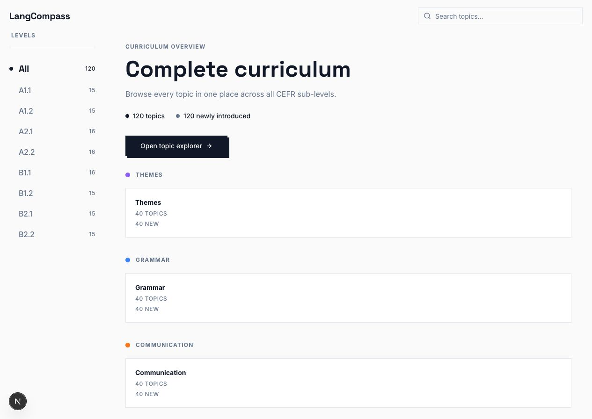
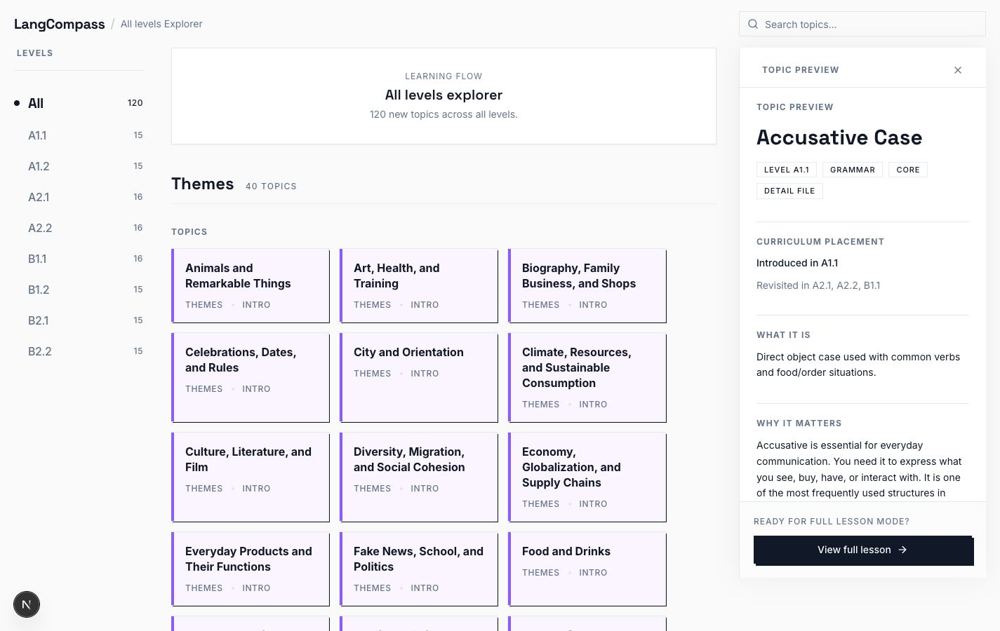
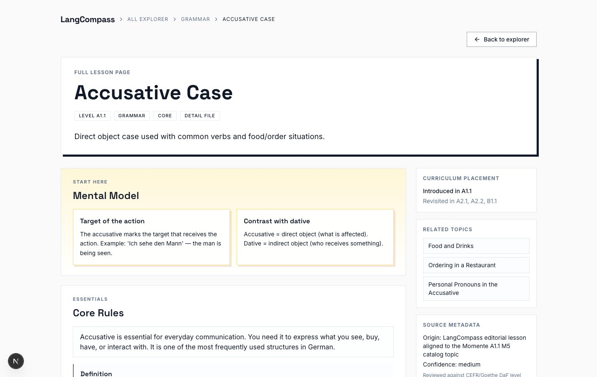

# LangCompass

[Open LangCompass](https://langcompass.vercel.app) · [Explore the curriculum](https://langcompass.vercel.app/explorer)

LangCompass is a free, static-first German learning explorer for seeing how CEFR levels, themes, grammar, and communication skills fit together.

It is intentionally a focused learning map—not a chat interface, account-based course platform, or replacement for a teacher or textbook.



## What You Can Do

- Scan the complete curriculum or focus on one CEFR sub-level.
- Browse related theme, grammar, and communication topics in module order.
- Search across titles, aliases, keywords, summaries, and lesson metadata.
- Open a compact topic preview before moving into a full lesson.
- Follow prerequisites, related topics, examples, common mistakes, and level progression where available.
- On supported desktop Chrome devices, use optional on-device learning tools to translate, explain, create examples, summarize lessons, and check German sentences.

The shortest useful path is:

1. Open the [curriculum overview](https://langcompass.vercel.app).
2. Select `All` or a level such as `A2.1`.
3. Open the explorer and search or browse by section.
4. Select a topic for a quick preview.
5. Open its full lesson when you want examples and deeper context.

Good starting points include `Accusative Case`, `Ordering in a Restaurant`, `Travel and Holidays`, and `Giving Advice`.

### Explorer and topic preview



### Full lesson page



## Learning Design

LangCompass uses a few simple design principles:

- **Map before detail.** A visible curriculum helps learners understand where a topic belongs before studying it in isolation.
- **Learn in connected groups.** Every module combines a theme, a grammar focus, and a communication goal.
- **Use progressive disclosure.** The overview, preview, and full lesson provide increasing depth without presenting everything at once.
- **Make revisitation visible.** Topics can show where they first appear and where later levels return to them.
- **Keep navigation predictable.** CEFR and module order determine the learning sequence instead of alphabetical sorting.

These are product-design choices, not claims of formal learning certification.

## Curriculum and Editorial Provenance

The current repository covers `A1.1` through `B2.2`: 40 modules and 120 topics, with one theme, grammar, and communication topic in every module.

- The 90 catalog topics from `A1.1` through `B1.2` are aligned to the module structure of *Momente*.
- The 30 `B2.1` and `B2.2` catalog topics are LangCompass extensions.
- Rich lesson pages are original LangCompass editorial content aligned to those catalog topics. They do not copy external lesson text.
- Every ready lesson includes source-style and confidence metadata. Confidence records the depth of editorial review; it is not a claim of native-teacher or institutional certification.

LangCompass is an independent project and is not affiliated with or endorsed by Hueber, *Momente*, Goethe-Institut, or the CEFR framework's governing bodies. See the [content quality audit](docs/content-quality-audit.md) for the current editorial assessment.

## Run It Locally

### Requirements

- Node.js 24 (the version in `.nvmrc`)
- npm

```bash
git clone https://github.com/asadkhalid305/langcompass.git
cd langcompass
source ~/.nvm/nvm.sh
nvm use
npm ci
npm run dev
```

Open [http://127.0.0.1:3000](http://127.0.0.1:3000).

No environment variables are required for normal local development. `NEXT_PUBLIC_SITE_URL` may optionally set the canonical metadata origin in a non-Vercel deployment; Vercel supplies its production URL automatically.

## Verify a Change

```bash
npm run validate:topics
npm test
npm run lint
npm run build
```

The same verification runs in GitHub Actions for pull requests and pushes to `develop`.

## Extend the Project

LangCompass keeps content in two places:

- [`data/topic-catalog.json`](data/topic-catalog.json) is the navigation and search index.
- [`data/topic-details`](data/topic-details) contains optional rich lesson content.

To add or improve a topic:

1. Add or update its catalog entry.
2. Optionally add `data/topic-details/<topicId>.json` for a full lesson.
3. Keep `topicId` identical across the catalog, detail filename, relationships, and routes.
4. Use `themes`, `grammar`, or `communication` as the section.
5. Use a real CEFR sub-level; `All` exists only in the interface.
6. Run topic validation and tests before opening a pull request.

Missing detail files are valid. The app deliberately falls back to catalog metadata so contributors can expand the curriculum gradually.

## Technology and Boundaries

The app uses Next.js App Router, React, TypeScript, Tailwind CSS, shadcn/ui primitives, Zod, Fuse.js, and static JSON data.

The current version intentionally has no authentication, database, AI backend service, embeddings, or vector search. Optional learning tools use supported Chrome features on the learner's device and do not change the static hosting model.

For help using the optional feature, see [the learning tools user guide](docs/learning-tools.md). For deeper implementation context, see [the architecture guide](docs/architecture.md).

## License

LangCompass is available under the [MIT License](LICENSE).
